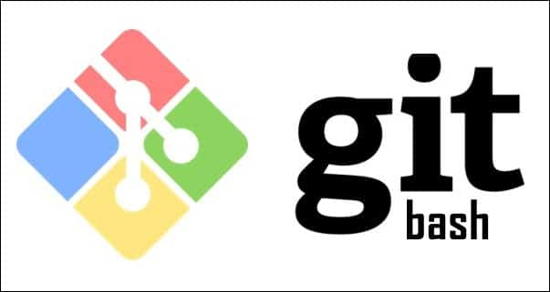
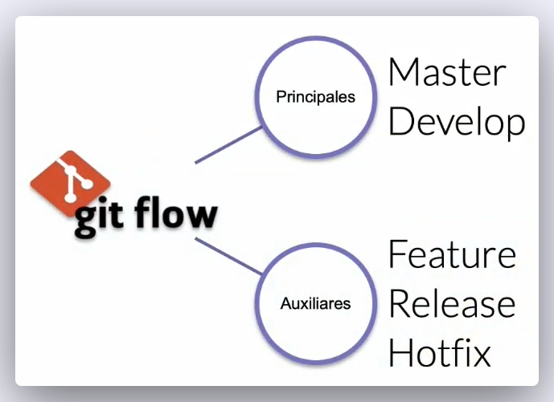

# Programación I Comandos Git y GitBash (UTN)



## Información
Alumno: Héctor Armando Cortez ([LinkedIn](https://www.linkedin.com/in/hector-cortez-cy/))
<br>
Institución: [UTN Facultad Regional San Rafael](https://www.frsr.utn.edu.ar/)
<br>
Asignatura: Programación I GitBash
<br>
Profesor: Profesor Ariel Betancud ([GitHub](https://github.com/ArielBetancud22))
<br>
Grupo: DynamicDevs
<br>
Cohorte: 2024

A continuación se detalla lo visto en cada clase de Git y comandos de Terminal en la Tecnicatura Universitaria en Programación de la [UTN Facultad Regional San Rafael](https://www.frsr.utn.edu.ar/). Utilice el índice debajo para navegar entre las clases impartidas.

* [CLASE 1 MIÉRCOLES 27 DE MARZO DEL 2024](#clase-1-miércoles-27-de-marzo-del-2024)
    * [Clase Anterior](#lo-que-vimos-en-la-clase-anterior)
    * [Creación de Carpetas](#ahora-comenzamos-con-la-creación-de-carpetas)
* [CLASE 2 MIÉRCOLES 3 DE ABRIL DEL 2024](#clase-2-miércoles-3-de-abril-del-2024)
    * [Crear Repositorio Git](#crea-un-repositorio-de-git-y-haz-tui-primer-commit)
* [CLASE 3 MIÉRCOLES 10 DE ABRIL DEL 2024](#clase-3-miércoles-10-de-abril-del-2024)
    * [Analizar Cambios en los Archivos de tu Proyecto Git](#analizar-cambios-en-los-archivos-del-proyecto-git)
* [CLASE 4 MIÉRCOLES 17 DE ABRIL DEL 2024](#clase-4-miércoles-17-de-abril-del-2024)
    * [Analizar cambios en los archivos](#analizar-cambios-en-los-archivos-de-tu-proyecto-git)
* [CLASE 5 MIÉRCOLES 24 DE ABRIL DEL 2024](#clase-5-miércoles-24-de-abril-del-2024)
    * [¿Qué es el Staging?](#¿qué-es-el-staging)
    * [¿Qué es Gitflow?](#¿qué-es-gitflow)
    * [¿Qué es Branch y cómo funciona un Merge en Git?](#¿qué-es-branch-y-cómo-funciona-un-merge-en-git)
* [CLASE 6 MIÉRCOLES 8 DE MAYO DEL 2024](#clase-6-miércoles-8-de-mayo-del-2024)
    * [Uso de comandos _resert_ y _checkout_](#volver-en-el-tiempo-en-nuestro-repositorio-utilizando-reset-y-checkout)
* [CLASE 7 MIÉRCOLES 15 DE MAYO DEL 2024](#clase-7-miércoles-15-de-mayo-del-2024)
    * [Git reset vs. Git rm](#git-reset-vs-git-rm)
    * [Tres Árboles en Git](#tres-árboles-en-git)
    * [¿Cómo funciona Git Reset en tu flujo de trabajo?](#¿cómo-funciona-git-reset-en-tu-flujo-de-trabajo)
    * [Variaciones de git reset](#variaciones-de-git-reset)
    * [¿Qué es git reset HEAD?](#¿qué-es-git-reset-head)
    * [Variaciones de git rm](#variaciones-de-git-rm)
    * [¿Cuál es la diferencia entre git rm y git reset Head?](#¿cuál-es-la-diferencia-entre-git-rm-y-git-reset-head)
    * [¿Cuándo utilizar git reset en lugar de git revert?](#¿cuándo-utilizar-git-reset-en-lugar-de-git-revert)
* [CLASE 8 MIÉRCOLES 22 DE MAYO DEL 2024](#clase-8-miércoles-22-de-mayo-del-2024)
    * [Flujo de trabajo básico con un repositorio remoto](#flujo-de-trabajo-básico-con-un-repositorio-remoto)
    * [Comandos para trabajo remoto con GIT](#comandos-para-trabajo-remoto-con-git)
* [CLASE 9 MIÉRCOLES 29 DE MAYO DEL 2024](#clase-9-miércoles-29-de-mayo-del-2024)
    * [Introducción a las ramas en Git](#introducción-a-las-ramas-en-git)
    * [Cómo funcionan las ramas en GIT](#cómo-funcionan-las-ramas-en-git)
    * [Practica](#practica)
* [CLASE 10 MIÉRCOLES 5 DE JUNIO DEL 2024](#clase-10-miércoles-5-de-junio-del-2024)
    * [Fusión de ramas con Git merge](#fusión-de-ramas-con-git-merge)
    * [Funcionamiento de Git merge](#funcionamiento-de-git-merge)
    * [¿Cómo unir dos ramas en git?](#¿cómo-unir-dos-ramas-en-git)
    * [¿Cómo realizar un merge en git?](#¿cómo-realizar-un-merge-en-git)
    * [Comandos básicos de GitHub](#comandos-básicos-de-github)
    * [Comando en producción (solución de conflictos)](#comando-en-producción-solución-de-conflictos)
* [CLASE 11 MIÉRCOLES 12 DE JUNIO DEL 2024](#clase-11-miércoles-12-de-junio-del-2024)
    * [Resolución de conflictos al hacer merge](#resolución-de-conflictos-al-hacer-merge)
    * [Cómo revertir un merge](#cómo-revertir-un-merge)
    * [Conflictos en repositorios remotos](#conflictos-en-repositorios-remotos)
    * [Sección Práctica](#sección-práctica)
* [CLASE 12 MIÉRCOLES 19 DE JUNIO DEL 2024](#clase-12-miércoles-19-de-junio-del-2024)
    * [Cómo funcionan las llaves públicas y privadas](#cómo-funcionan-las-llaves-públicas-y-privadas)
    * [Cómo funciona un mensaje cifrado con llaves públicas y privadas](#cómo-funciona-un-mensaje-cifrado-con-llaves-públicas-y-privadas)

## CLASE 1 MIÉRCOLES 27 DE MARZO DEL 2024
### Lo que vimos en la clase anterior:
> Abrimos la terminal de **Git Bash** en **Windows** o la terminal de **Ubuntu**, tambien la terminal de **Mac**, y comenzamos con los siguientes comandos y creación de directorios:
> - ``pwd`` Vemos la ruta de la carpeta en la que estamos.
> - ``cd`` Es para navegar a una carpeta: change directory -> cambiar de directorio.
> - ``cd /`` Nos llava al home, en la raíz del disco.
> - ``cd ~`` La virgulilla significa que estamos en el lugar de los documentos o del usuario.
> - ``ls`` Esto es listar los archivos, nos muestra todos los archivos en la raíz.
> - ``ls -al`` El espacio ``-al`` significa que es un argumento especial para ver _archivos ocultos_.
> - Usar la flecha hacía arriba nos muestra el último comando utilizado.
> - ``ls -l`` Muestra casi todos los archivos sin los que están ocultos.
> - ``ls -a`` Muestra el grupo de archivos pero no en una lista.
> - ``clear`` Limpia la consola o Ctrl + L.
> - ``cd ..`` Nos devuelve a la carpeta anterior.
> - ``cd U + Tab`` Esto se usa para un autocompletado o para buscar una referencia.
> - ``cd /D`` Cambiamos de disco en window.
> - ``df -h`` Muestra todos los directorios en __Ubuntu__.
> - ``cd /mnt/d`` Cambia de directorio usando __WSL Ubuntu en Windows__.

### Ahora Comenzamos con la Creación de Carpetas
Abrimos la terminal de Git Bash y tecleamos los siguientes comandos.
<br>
Importante seguir los pasos uno a uno.

1. ``cd ..`` nos llevará a nustra carpeta de usuario

2. ``cd ..`` nos lleva al disco principal de nuestra PC
3. ``cd /mnt/c`` para cambiar el directorio
4. ``cd ~`` para ir a la raíz
5. ``mkdir Tecnicatura`` para crear la carpeta Tecnicatura
6. ``cd tecnicatura`` para ingresar a la carpeta creada en el paso anterior
7. ``mkdir Python``
8. ``mkdir Java``
9. ``mkdir JavaScript``

> [!NOTE]
> Recordar que en window las mayúsculas no tienen relevancia, pero si en Linux

Revisar y ejecutar cada comando, hacerlo como practica.

## CLASE 2 MIÉRCOLES 3 DE ABRIL DEL 2024
Abrir git bash en **Windows** o la terminal de __Linux__ o de __Mac__: al abrir Git Bash hacerlo como administrador.

Crea un archivo con su extención.
- ``touch nombre-archivo.txt``

Una vez creado, abrirlo y escribir unas líneas dentro.Ctrl + S para guardar lo que escribimos en el archivo.

- ``./`` Significa la carpeta actual
- ``../`` Significa la carpeta anterior
- ``cat nombre-archivo.txt`` Vemos el contenido del archivo
- ``history`` Veremos la historia completa de los comandos que hemos utilizado
- ``!72 + enter`` Veremos el comando que utilizamos en ese número
- ``rm nombre-archivo.txt`` Borra el archivo seleccionado.

> [!WARNING]
> La acción ``rm nombre-archivo.txt`` no se puede deshacer.

- ``rm --help`` Muestra como funciona el comando

### Crea un repositorio de Git y haz tui Primer Commit
Realizada la ejecución de cada comando en el orden especificado.
1. Ingresamos a la carpeta creada en la [primer clase](#ahora-comenzamos-con-la-creación-de-carpetas) con el siguiente comando: ``cd tecnicatura``

2. Creamos la carpeta class-git con el siguiente comando: ``mkdir class-git``
3. Entramos en la carpeta que necesitamos trabajar: ``cd class-git``
4. Creamos un repositorio en la carpeta central: ``git init``. Se crea el archivo .git (este archivo está oculto por defecto).
5. Abrimos VSC: ``code .`` el punto hace que se abra el archivo en el que estamos situados.
6. Ya en Visual Studio Code, creamos un archivo nuevo con Ctrl + N y escribimos en él.
7. Guardamos el archivo con Ctrl + S poniendo el nombre: _historia.txt_
8. Vemos el estado del proyecto en tiempo real con el comando ``git status`` y vemos que esta en el área de trabajo.
9. Enviamos el archivo al área de preparación con ``git add historia.txt``
10. Para ver el estado de cambios escribimos ``git status``
11. Quitamos el archivo del área de preparación con ``git rm --cached historia.txt``, ``cached`` significa que esta en memoria RAM.
12. Con ``git config`` tedremos la lista de como funciona la configuración de Git.
13. Escribimos ``git config --list`` para ver las configuraciones por defecto, faltan cosas importantes. Para salir de la vista precionar la tecla Q.
14. Para ver dónde están guardadas las configuraciones guardadas, escribimos el diguiente comando: ``git config --list --show-origin``
15. Para configurar un nombre se usuario en Git, escribir lo siguiente en la terminal: ``git config --global user.name "Tu Nombre Completo". Dentro de las comillas dobles colocar tu nombre completo.``
16. De la misma forma que antes, vamos a establecer un valor para el correo en Git con el siguiente comando: ``git config --global user.email "tu_correo@correo.com"``.  Dentro de las comillas dobles colocar tu correo personal.

> [!IMPORTANT]
> Colocar un correo válido y personal, ya que utilizaremos el mismo para crear una cuenta en [GitHub](https://github.com/).

17. Listamos nuevamente las configuraciones de Git con ``git config --list`` y veremos que ya están todos nuestros datos completos.

18. Ingresamos todos los archivos al área de preparación (RAM) con el siguiente comando: ``git add .``
19. Escribimos lo siguiente en la terminal: ``git commit -m "Mensaje importante del commit"``. El mensaje dentro de las comillas sirve para identificar qué cambios o modificaciones se realizaron en el o los archivos. Por esta razón debemos colocar un mensaje descriptivo para cada commit que realicemos.
20. Volvemos a abrir nuestro Visual Studio Code ``code .`` y hacemos cambios en el archivo, luego guardamos.
21. Revisamos nuestra área de trabajo con ``git status`` y vemosz que hay cambios para _commitear_.
22. Los agregamos al área de preparación con ``git add .``
23. Creamos otro commit con ``git commit -m "Mensaje importante del commit"``
24. Por último vemos todo el historial de este archivo con ``git log historia.txt``. El número largo es el hash o _identificador_ del commit.

Revisar y ejecutar cada comando, hacerlo como practica.

## CLASE 3 MIÉRCOLES 10 DE ABRIL DEL 2024
### Analizar Cambios en los Archivos del Proyecto Git

Ingresamos de la siguiente manera:
<br>
Abrir git bash en __Windows__ o la terminal de __Linux__ o de __Mac__: al abrir Git Bash hacerlo como _administrador_, en terminal también o usar ``sudo`` para permisos especiales.

- ``cd tecnicatura`` Ingresamos al direcotorio donde están nuestras carpetas de trabajo

- ``ls`` Vemos los archivos y directorios que ya tenemos

- ``cd git`` No hay nada

- ``cd ..`` Salimos

- ``rm historia.txt`` Eliminamos el archivo que habíamos hecho, esto en git bash (Windows) esto es para practica

- ``rm Git`` Al intentar el comando anterior recibimos el siguiente mensaje:
> rm: cannot remove 'Git': Is a directory

- ``rm --recursive -R Git`` Al intentar el comando anterior recibimos el siguiente mensaje:
> By default, rm does not remove directories.  Use the --recursive (-r or -R) arguments option to remove each listed directory, too, along with all of its contents 

- ``rm --help`` Nos muestra lo que les puse arriba como documentación en Inglés.

- ``mkdir class-git`` Creamos la carpeta o directorio para trabajar en Git local por ahora.

- ``cd class-git`` Entramos para crear el __README.md__ para este sector.

- ``touch README.md`` Vamos a crear un archivo nuevo, ``md`` significa _markdown_ y se pueden trabajar con editores de texto. Este es un lenguaje que transforma el texto a html.

- Enlace a la documentación en GitHub de [MARKDOWN](https://docs.github.com/es/get-started/writing-on-github/getting-started-with-writing-and-formatting-on-github/basic-writing-and-formatting-syntax)

- Leemos la documentación para ir creando en __README.md__ como lo enseña GitHub.

- ``code .`` Para abrir VSC y editar el archivo.

- Empezamos a cargar lo visto en las clases anteriores (Comandos) en el README y pasamos a commitear.

- Realizamos los siguientes comandos en orden:
```
git status

git add .

git status

git commit -m "Cargamos el README dentro del directorio class-git"

git status
```
- ``git log`` Para ver los dos commits hechos: Si tienes commiteada alguna clase anterior veras mas commits dentro.

- ``cd ..`` Para salir de la carpeta actual (class-git)

- ``cd ..`` Para salir de la carpeta actual (Tecnicatura) y volver a la raíz

Revisar y ejecutar cada comando, hacerlo como practica

## CLASE 4 MIÉRCOLES 17 DE ABRIL DEL 2024
### Analizar cambios en los archivos de tu proyecto Git

Ingresamos de la siguiente manera:
- Abrir git bash en __Window__ o la terminal de __Linux__ o de __Mac__: al abrir Git Bash hacerlo como administrador, en terminal también o usar sudo para permisos especiales.
```
cd tecnicatura
cd class-git
ls
touch historia.txt
code .
```
- Modificamos el archivo historia.txt colocando lo siguiente: 
> Bienvenido, mi nombre es Ariel (coloca tu nombre)

```ctrl + s
git status
git add .
git status
git commit (Sin agregar -m veremos que pasa)
```
- Agregar mensaje y salir con la tecla ESC o ```:wq! + enter```
- Agregamos otra línea de mensaje en historia.txt desde VSC:
> estoy estudiando programación

```
ctrl + s
git add .
git commit
```

- Se abre un editor de código basado en línea de comandos, editor de texto como VSC llamado __Vim__
- Esc + i #Para comenzar a escribir mensaje del commit, no suele ser necesario
- Para salir en linux: ```ctrl + x```
- Para decir si al cambio y aceptar el nombre, ósea no cambiamos el nombre, la (s) es de si y la (y) es de yes, no olvidar enter en linux: ```s + enter```
- Vemos todos los cambios en el último commit:
```
git show
git log historia.txt (Vemos todos los commit)
q (para salir del registro de commits)
```
- Copiamos un hash mas antoguo y otro reciente, ingresamos el siguiente comando:
```
git diff hash_commit_numerico hash_commit_numerico 
```
- Con el comando anterior comparamos diferentes commits y sus cambios. Recuerden poner la versión mas vieja primero, luego la mas nueva.
- Para salir presionar ```q```
```
cd ..
cd ..
```

Revisar y ejecutar cada comando, hacerlo como practica

## CLASE 5 MIÉRCOLES 24 DE ABRIL DEL 2024
### ¿Qué es el _staging_?
Tienes una carpeta donde están los archivos de tu proyecto o un directorio y allí tenemos el archivo ```historia.txt```. Cuando entramos por consola a ese archivo y creamos el ```git init```, se crea un área en memoria RAM que se llama __staging__, y el otro es el repositorio esta es la carpeta ```.git``` donde estarán todos los cambios al final del proyecto.
<br>
Entonces tenemos el área de trabajo, cuando colocamos ```git add historia.txt``` pasamos al __staging__ o área de preparación (recordar que esto es en la memoria RAM) y luego con ```git commit -m "Mensaje"``` pasa al repositorio en la rama ```master/main```. Allí se genera un nombre lleno de letras y números, esto es el hash, el nombre del commit.

### ¿Qué es _Gitflow_?
Gitflow es un modelo alternativo de creación de ramas en __Git__ en el que se utilizan ramas de función y varias ramas principales. Fue Vincent Driessen en __nvie__ quien lo publicó por primera vez y quien lo popularizó.



### ¿Qué es _branch_ y cómo funciona un _merge_ en git?
Tenemos una rama llamada ```master``` y es donde están los cambios de nuestros archivos, con cada commit creamos una nueva versión.
<br>
Vamos a crear una rama experimental para otras versiones que suele llamarse _development_; al encontrar bug, se crea otra rama que suele llamarse _hotfix_ para hacer reparaciones.
<br>
Siempre que ya tengamos resultados favorables, es donde decidimos hacer un _merge_, es unir los resultados de las ramas a la rama ```master```.
<br>
La principal característica de las ramas principales es que solo existe una de cada tipo. El objetivo es que no se instancien y que no reciban código de forma directa a través de commit, siempre tienen que recibir código a través de ramas de tipo ```Feature```, ```Release``` y ```Hotfix```, siempre a través de ramas auxiliares.
<br>
Es un riesgo recibir código directamente en la rama ```master```, porque puede generar defectos en el repositorio en las subidas a producción, que no contemplemos o que no preveamos, por lo que siempre es mejor integrar código en otras ramas antes de integrar con las ramas ```master``` y ```develop```.

Esta es una metodología estricta pero que da lugar a diferentes interpretaciones o diferentes formas de llevarla en cada equipo, por lo que en algunos casos, algún experto puede permitirse no seguir esa norma, pero son casos muy específicos y siempre de personas de confianza.

En las ramas auxiliares tenemos la rama ```Feature```, la rama ```Release``` y la Rama ```Hotfix```, que puede instanciarse todas las veces que se consideren necesarias. A continuación veremos una introducción de para qué estas ramas existen:

- La rama ```Feature```: para nuevas características, nuevos requisitos o nuevas historias de usuario.
- La rama ```Release```: para estandarizar o cortar una serie de código que ha estado desarrollándose en la rama Develop, se saca una rama de este tipo, se mergea y ahí se depura.
- La rama ```Hotfix```: habitualmente se utiliza para depurar el código que venga de producción, por haberse detectado un defecto crítico en producción que deba resolverse, al que se le va a hacer una ```Release``` puntual para corregirlo.

Estas ramas tienen un principio y un fin, ya que son ramas que se _mergean_ con las ramas Master y Develop y desaparecen. Podemos tener tantas ramas como queramos, tantos repositorios como queramos, lo más importante es saber cuando hacemos un merge, porque es posible que hayan archivos que rompan otros archivos, a esto se lo llama conflicto o bug.

Hoy a sido un poco de teoría, repaso de todo lo que les dió la profe Naty.

Profesor Ariel Betancud

## CLASE 6 MIÉRCOLES 8 DE MAYO DEL 2024
### Volver en el tiempo en nuestro repositorio utilizando `reset` y `checkout`

Ingresamos de la siguiente manera: <br>
Abrir git bash en Window o la terminal de Linux o de Mac, al abrir Git Bash hacerlo como administrador, en terminal también o usar sudo para permisos especiales.

- `cd tecnicatura` para entrar an la carpeta especificada
- `cd class-git` para entrar en el directorio especificado
- `ls` para mostrar todos los archivos que tenemos en dicho directorio
- ``code .`` para abrir el editor Visual Studio Code desde la terminal y desde la posición especificada
- ``git log`` para ver los commit hechos hasta ahora
- Copiar el hash (el número largo que tiene el commit)
- ``git reset hash-del-commit`` este nos permite volver a una versión anterior. Hay 2 tipos de reset: el _hard_ y el _soft_
- ``git status`` para ver elestado de nuestra área de trabajo
- ``git add .`` para agregar los archivos al área de preparación
- ``git commit -m "Agregamos datos de estudios en historia.txt"`` para commitear los cambios
- ``git config --list`` para ver la configuración que ya hemos hecho con en nombre y email
- ``git reset hash-del-commit --hard`` para volver todo a su estado anterior, es el más usado, desaparece todo
- ``git reset hash-del-commit --soft`` Este es el suave, lo que tengamos en staging segirá allí

Crear un archivo ``portafolio.html`` e introducir código siguiendo los siguiente pasos:
- ``touch portafolio.html`` para crear el archivo especificado
- ``html : 5`` esto carga el código básico de html y podamos trabajar. Esto hacerlo en el aqrchivo
recientemente creado.
- ``ctrl + s`` para guardar
- Clic derecho en ``VSC -> Open with Live Server`` para que se abra en el navegador
- ``git status`` para ver el estado de nuestra área de trabajo
- ``ls`` para listar todos los archivos del directorio
- ``ls -al`` para listar nuevamente todos los archivos, incluso los ocultos
- ``git add .`` para agregar todos al área de preparación
- ``git status`` para nuevamente comprobr el estado de nuestra área de trabajo
- ``git commit -m "Agregamos el html para nuestro portafolio"`` para confirmar mediante commit nuestras modificaciones
- Creamos un archivo ``.css``. Este es un archivo de estilos, para esto creamos una nueva carpeta llamada ``css``
- ``mkdir css`` para crear la nueva carpeta
- ``ls`` para listar todos los archivos
- ``cd css`` para entrar en el nuevo directorio creado
- ``touch style.css`` para crear un archivo CSS. A continuación, agregamos estilos
- ``ctrl + s`` para guardar las modificaciones que realizamos en el archivo CSS
- Abrimos en el navegador y todo esta allí, pero todo esto supuestamente en git no existe.
- ``git status`` tenemos cosas en el área de trabajo, en staging distintas
- ``git diff`` para que nos muestre los cambios en memoria ram y en disco
- ``git add .`` Agregamos todo al staging area
- ``git status`` para nuevamente ver el working area. Ya esta todo en memoria ram, a git solo le importan los archivos, guarda las carpetas como rutas y automaticamente las crea
- ``git commit -m "Creamos el css para darle algo de estilo a nuestro portafolio"`` para confirmar los cambios mediante un commit
- ``git log`` vemos lo nuevo que hemos hecho sin lo que borramos con el reset fuerte
- hacer cambios en ``historia.txt``
- Cambiamos la última línea y guardamos con ``ctrl + s`` 
- ``git diff`` para ver una comparación de los cambios no commiteados en tu área de trabajo con la última versión commiteada (HEAD)
- ``git commit -am "cambio en la última línea del historia.txt"`` para agregar al staging area y confirmar el commit al mismo tiempo
- ``git log`` para ver el historial de commits
- tecla ``q``  para salir
- ``git log --stat`` veremos los cambios especificos que hicimos en cuales archivos por medio del commit y veremos los cambios en bits
- Tecla ``q`` para salir de la línea de commits. Ahora queremos ver como era el archivo originalmente, para esto copiamos el nombre del primer commit
- ``git checkout hash-del-commit historia.txt`` Veremos el archivo en su estado original
- ``git status`` esto nos sugiere hacer un commit, si lo hacemos borramos todo lo que hicimos antes, debemos seguir con el siguiente commando
- ``git checkout master historia.txt`` para volver a la versión master del archivo historia.txt, esto es muy peligroso
- ``git checkout hash-del-commit historia.txt`` Volvemos a hacer esto y cambiamos cosas del archivo
- ``git commit -am "Reemplazo de una versión por otra de la historia"``
- ``git log`` Veremos los cambios sin tocar ningun otro archivo, esta es la forma de volver a una versión hacía atrás y llevarla a la cabeza de la master
- ``cd ..``
- ``cd ..``

Revisar y ejecutar cada comando, hacerlo como practica

## CLASE 7 MIÉRCOLES 15 DE MAYO DEL 2024
### Git reset vs. Git rm
Los comandos ``git reset`` y ``git rm`` tienen utilidades muy diferentes, pero pueden confundirse fácilmente.

El comando ``git reset`` es una herramienta poderosa que te permite deshacer o revertir cambios en tu repositorio Git. Lo puedes ejecutar de tres maneras diferentes, con las líneas de commando ``--soft``, ``--mixed`` y ``--hard``.
<br>
Pero como ``git checkout`` que nos deja ir, mirar, pasear y volver, con ``git reset`` volvemos al pasado sin la posibilidad de volver al futuro. Borramos la historia y la debemos sobreescribir. No hay vuelta atrás.

### Tres Árboles en Git
Para entender lo anterior, recordemos que los _“tres árboles”_ de Git son estructuras de datos basadas en nodos y punteros que Git utiliza para hacer seguimiento a un cronograma de ediciones, aunque no sean estructuras en forma de árbol en el sentido tradicional.
<br>
La mejor forma de entender estos mecanismos es creando un conjunto de cambios en un repositorio y siguiéndolos a través de los tres árboles. Averigüémoslo.

Ingresamos de la siguiente manera:

- Abrir git bash en Window o la terminal de Linux o de Mac, al abrir Git Bash hacerlo como administrador, en terminal también o usar sudo para permisos especiales.
- ``mkdir git_reset_test`` para realizar pruebas, es por esto que creamos una carpeta nueva
- ``cd git_reset_test`` entramos en la carpeta
- ``git init`` inicializamos el repositorio
- ``touch reset_file.txt`` para crear un nuevo archivo en este directorio
- ``git add reset_file.txt`` agregamos el nuevo archivo al staging area
- ``git commit -m "Iniciando el primer commit"`` confirmamos los cambios

### ¿Cómo funciona Git Reset en tu flujo de trabajo? 
_Git reset_ permite moverte entre diferentes commits para deshacer o rehacer cambios. Git guarda todo lo nuevo del repositorio como commits, que son instantáneas del estado del código en un momento dado y existen variaciones de este comando.

### Variaciones de git reset
- ``git reset --soft``: Borra el historial y los registros de Git de commits anteriores, pero guarda los cambios en Staging para aplicar las últimas actualizaciones a un nuevo commit. 
- ``git reset --hard``: Deshace todo, absolutamente todo. Toda la información de los commits y del área de staging se elimina del historial.
- ``git reset --mixed``: Borra todo, exactamente todo. Toda la información de los commits y del área de staging se elimina del historial. 
- ``git reset HEAD``: El comando ``git reset`` saca archivos del área de staging sin borrarlos ni realizar otras acciones. Esto impide que los últimos cambios en estos archivos se envíen al último commit. Podemos incluirlos de nuevo en staging con ``git add`` si cambiamos de opinión. Ten en cuenta que, si deshaces commits en un repositorio compartido en GitHub, estarás cambiando su historia y esto puede causar problemas de sincronización con otros colaboradores.

### ¿Qué es git reset HEAD? 
``git reset HEAD`` es un comando que te permite revertir los cambios que ya habías preparado para subir, y moverlos de vuelta a tu proyecto. Con este comando puedes cancelar los cambios que ya habías agregado, para que puedas revisarlos, modificarlos o deshacerlos antes de confirmarlos con un commit.
<br>
``git rm`` Por otro lado, es un comando que nos ayuda a eliminar archivos de Git sin eliminar su historial del sistema de versiones. Para recuperar el archivo eliminado, necesitamos retroceder en la historia del proyecto, recuperar el último commit y obtener la última confirmación antes de la eliminación del archivo.

Es importante tener en cuenta que ``git rm`` no puede usarse sin evaluarlo antes. Debemos usar uno de los flags siguientes para indicarle a Git cómo eliminar los archivos que ya no necesitamos en la última versión del proyecto.

### Variaciones de git rm
- ``git rm --cached``: Elimina archivos del repositorio local y del área de staging, pero los mantiene en el disco duro. Deja de trackear el historial de cambios de estos archivos, por lo que quedan en estado untracked, que significa: que un archivo no está siendo rastreado por Git
- ``git rm --force``: Elimina los archivos de Git y del disco duro. Git guarda todo, por lo que podemos recuperar archivos eliminados si es necesario (empleando comandos avanzados). ¡Al usar git rm lo que haremos será eliminar este archivo completamente de git!

### ¿Cuál es la diferencia entre git rm y git reset Head?
La diferencia principal entre ``git rm`` y ``git reset HEAD`` radica en que ``git rm`` elimina archivos del repositorio y de la historia del proyecto, mientras que ``git reset`` saca los cambios del área de preparación y los mueve al espacio de trabajo, sin afectar la historia del repositorio.

Es importante tener en cuenta el efecto que cada comando tiene en el proyecto y usarlos según tus necesidades y objetivos específicos.

### ¿Cuándo utilizar git reset en lugar de git revert?
Para reescribir la historia del repositorio y eliminar confirmaciones anteriores, se utiliza ``git reset``. Para deshacer cambios de confirmaciones anteriores de forma segura sin modificar la historia del repositorio, se emplea ``git revert``.

> Para evitar problemas en el trabajo, es valioso entender las implicaciones y riesgos de cada comando y elegir el enfoque adecuado según las necesidades y el flujo de trabajo del proyecto.

Con ``git rm`` eliminamos un archivo de Git, pero mantenemos su historial de cambios. Si no queremos borrar un archivo, sino dejarlo como está y actualizarlo después, no debemos usar este comando en este commit.

Empleando ``git reset HEAD``, movemos los cambios de _Staging_ a _Unstaged_, pero mantenemos el archivo en el repositorio con los últimos cambios en los que hicimos commit. Así, no perdemos nada relevante.

## CLASE 8 MIÉRCOLES 22 DE MAYO DEL 2024
### Flujo de trabajo básico con un repositorio remoto
Cuando empiezas a trabajar en un entorno local, el proyecto vive únicamente en tu computadora. Esto significa que no hay forma de que otros miembros del equipo trabajen en él.
<br>
Para solucionar esto, utilizamos los servidores remotos: un nuevo estado que deben seguir nuestros archivos para conectarse y trabajar con equipos de cualquier parte del mundo.
<br>
Estos servidores remotos pueden estar alojados en GitHub, GitLab, BitBucket, entre otros. Lo que van a hacer es guardar el mismo repositorio que tienes en tu computadora y darnos una URL con la que todos podremos acceder a los archivos del proyecto. Así, el equipo podrá descargarlos, hacer cambios y volverlos a enviar al servidor remoto para que otras personas vean los cambios, comparen sus versiones y creen nuevas propuestas para el proyecto. Esto significa que debes aprender algunos nuevos comandos

### Comandos para trabajo remoto con GIT
- ``git clone url_del_servidor_remoto`` Nos permite descargar los archivos de la última versión de la rama principal y todo el historial de cambios en la carpeta ``.git``
- ``git push`` Luego de hacer ``git add`` y ``git commit`` debemos ejecutar este comando para mandar los cambios al servidor remoto.
- ``git fetch`` Lo usamos para traer actualizaciones del servidor remoto y guardarlas en nuestro repositorio local (en caso de que hayan, por supuesto).
- ``git merge`` También usamos el comando ``git merge`` con servidores remotos. Lo necesitamos para combinar los últimos cambios del servidor remoto y nuestro directorio de trabajo.
- ``git pull`` Básicamente, ``git fetch`` y ``git merge`` al mismo tiempo.

Adicionalmente, tenemos otros comandos que nos sirven para trabajar en proyectos muy grandes:
- ``git log --oneline`` Te muestra el id commit y el título del commit.
- ``git log --decorate`` Te muestra donde se encuentra el head point en el log.
- ``git log --stat`` Explica el número de líneas que se cambiaron brevemente.
- ``git log -p`` Explica el número de líneas que se cambiaron y te muestra qué se cambió en el contenido.
- ``git shortlog`` Indica qué commits ha realizado un usuario, mostrando el usuario y el título de sus commits.
- ``git log --graph --oneline --decorate --all``
- ``git log --pretty=format:"%cn hizo un commit %h el dia %cd"`` Muestra mensajes personalizados de los commits.
- ``git log -3`` Limitamos el número de commits, en este caso a solo 3
- ``git log --after=“2018-1-2”``
- ``git log --after=“today”`` 
- ``git log --after=“2018-1-2” --before=“today”`` para localizar commits por fechas
- ``git log --author=“Name Author”`` para traer commits hechos por autor que cumplan exactamente con el nombre
- ``git log --grep=“INVIE”`` Busca los commits que cumplan tal cual está escrito entre las comillas
- ``git log --grep=“INVIE” –i`` Busca los commits que cumplan sin importar mayúsculas o minúsculas
- ``git log – index.html`` Busca los commits en un archivo en específico
- ``git log -S “Por contenido”`` Buscar los commits con el contenido dentro del archivo
- ``git log > log.txt`` guardar los logs en un archivo ``.txt``

## CLASE 9 MIÉRCOLES 29 DE MAYO DEL 2024
### Introducción a las ramas en Git
Cuando entramos en el proyecto veremos que nos encontramos con la rama ``master``, y es a partir de allí que debe saber que esta es la rama madre o rama principal, y las otras ramas se crean para no afectar a la ``master``.

Las ramas (_branches_) son la forma de hacer cambios en nuestro proyecto sin afectar el flujo de trabajo de la rama principal. Esto porque queremos trabajar una parte muy específica de la aplicación o simplemente experimentar.

La cabecera o ``HEAD`` representa la rama y el commit de esa rama donde estamos trabajando. Por defecto, esta cabecera aparecerá en el último commit de nuestra rama principal. Pero podemos cambiarlo al crear una rama (para esto se pueden usar cualquiera de los siguientes comandos:``git branch rama``, ``git checkout -b rama``) o movernos en el tiempo a cualquier otro commit de cualquier otra rama con los comandos ``git reset id-commit``, ``git checkout rama-o-id-commit``.

> ¿Qué es Git? Repasemos:<br>
> Git es un sistema de versiones, las cuales entre sus principales características nos permite utilizarlo como un repositorio donde guardar diferentes versiones de nustros archivos. Generalmente es usado para dar seguimiento y control del desarrollo de un proyecto a nivel código.

### Cómo funcionan las ramas en GIT
Las ramas son la manera de hacer cambios en nuestro proyecto sin afectar el flujo de trabajo de la rama principal. Esto porque queremos trabajar una parte muy específica de la aplicación o simplemente experimentar.

- ``git branch nombre-de-la-rama`` Con este comando se genera una nueva rama
- ``git checkout nombre-de-la-rama`` Con este comando puedes saltar de una rama a otra
- ``git checkout -b rama`` Genera una rama y nos mueve a ella automáticamente, es decir, es la combinación de git branch y git checkout al mismo tiempo
- ``git reset id-commit`` Nos lleva a cualquier commit no importa la rama, ya que identificamos el id del tag, eliminando el historial de los commit posteriores al tag seleccionado
- ``git checkout rama-o-id-commit`` Nos lleva a cualquier commit sin borrar los commit posteriores al tag seleccionado

### Practica
Mientras estamos en la rama master, vamos a crear una rama paralela y a esta rama la vamos a llamar __segunda__. La vamos a fusionar para ver como queda en la rama master y así entender el flujo de ramas en git.
<br>
Al crear otra rama estamos creando una copia de todos los commit que ya tiene la rama master en la nueva rama y todos los cambios que hagamos en ésta, no se verán reflejados en la rama master hasta que las fusionemos con un proceso que se llama _merge_.

- Abrir como adminstrados la terminal o git bash
- ``cd Tecnicatura``
- ``cd class-git``
- ``code .``
- ctrl + s
- clic derecho, abrimos en el navegador con Live Server para ver los cambios
- ``git status``
- ``git commit -am "mensaje del commit"`` Este solo funciona con archivos creado previamente
- ``git commit -a -m "Mensaje del commit"`` Esto es lo mismo que el anterior
- ``git commit -a`` + Enter (se abrira el entorno Vim para editar el mensaje del commit)
- Escribir el mensaje
- ctrl + x
- s + Enter (no cambiar el nombre ni ruta de ubicación)
- ``git log`` Veremos los cambios guardados
- q (para salir)
- ``git log --stat`` Veremos los cambios nombrando cada archivo
- q (para salir)
- ``git branch`` Muestra en la rama que estamos, desde aquí crearemos una nueva
- ``git show`` Muestra el último cambio que hicimos, esto significa que desde el HEAD -> master es que haremos cambios
- q (para salir)
- ctrl + l (limpiamos consola)
- ``git branch segunda`` creamos una nueva rama
- ``git show`` Nos muestra ahora que esta en el HEAD -> master, cabecera aquí es donde esta apuntando, es decir el último commit esta pegado a dos ramas distintas, aunque todavía estemos en master
- q (para salir)
- ``git status`` No hay nada para hacer commit
- ``git chekout segunda`` Nos movemos hacía otras ramas, en este caso a ``segunda``
- ``git branch`` veremos en que rama estamos ubicados o ingresando
- ``git status`` Veremos en que HEAD estamos apuntando
- Seguimos los pasos del tutor Nicolás Martinez para editar nuetro portafolio web
- ctrl + s
- F5 (actualizamos en el navegador para ver los cambios)
- ``git status`` Veremos el archivo que modificamos
- ``git add .``
- ``git commit``
- En Vim escribimos el mensaje del commit
- ctrl + x
- s (para un si)
- Enter (terminado el mensaje del commit)
- ``git status`` No hay mas nada para commitear y estamos en la rama segunda
- ``git show`` Vemos todo lo que cambiamos
- q (para salir)
- ``git log`` Nos muestra donde estabamos con la rama master y el HEAD paso a la rama cabecera
- q (para salir)
- ``git checkout master`` Volvemos a la rama master, desaparese lo que habíamos hecho
- ``git log`` No muestra lo que hicimos en el portafolio
- q (para salir)
- ``git checkout segunda`` Volvemos a ver todos los cambios que hicimos de nuevo

Revisar y ejecutar cada comando, hacerlo como práctica.

## CLASE 10 MIÉRCOLES 5 DE JUNIO DEL 2024
### Fusión de ramas con Git merge
La fusión en Git es la forma en que este sistema une un historial bifurcado. El comando ``git merge`` permite integrar líneas de desarrollo independientes generadas por ``git branch`` en una sola rama. Con este comando, podemos crear un nuevo commit que combina dos ramas o branches: la rama actual y la rama que se indica después del comando.
<br>
Estos comandos de fusión del merge afectan solo a la rama actual y no a la rama de destino. Por lo tanto, te recomendamos utilizar ``git checkout`` para seleccionar la rama actual y ``git branch -d`` para eliminar la rama de destino obsoleta.

### Funcionamiento de Git merge
``Git merge`` fusiona secuencias de confirmaciones en un solo historial, generalmente para combinar dos ramas. Busca una confirmación de base común y genera una confirmación de fusión que representa la combinación de las dos ramas hasta el resultado final.


### ¿Cómo unir dos ramas en git?
Ahora bien, para combinar ramas en tu repositorio local, usa ``git checkout`` para cambiar a la rama donde deseas fusionar. Por lo general, esta es la rama principal. Luego, emplea ``git merge`` y especifica el nombre de la otra rama que deseas traer a esta rama. Ten en cuenta que esto es una combinación de avance rápido.

### ¿Cómo realizar un merge en git?
Para hacer un merge en Git, primero asegúrate de estar en la rama correcta. Después, usa el comando ``git merge`` seguido del nombre de la rama que quieres combinar. Por ejemplo, si quieres crear un nuevo commit en la rama master con los cambios de la rama segunda, usa este comando:

> ``git checkout master``
<br>
``git merge segunda``

Es importante tener en cuenta que en caso de haber conflictos, debes guardar tus cambios antes de hacer ``git checkout`` para evitar perder tu trabajo. También es recomendable emplear los comandos básicos de GitHub, como ``git fetch``, ``git push`` y ``git pull``, para mantener actualizado tu repositorio.

En este ejemplo, vamos a crear un nuevo commit en la rama master combinando los cambios de una rama llamada ``segunda``: Otra opción es crear un nuevo commit en la rama ``segunda`` combinando los cambios de cualquier otra rama:

Git es asombroso porque puede saber cuáles cambios deben conservarse en una rama y cuáles no. En casos de conflictos, asegúrate de guardar tus cambios antes de hacer ``git checkout`` para evitar perder tu trabajo.

### Comandos básicos de GitHub
- ``git init`` crear un repositorio, si ya esta en la nube traerlo sin hacer ``git init``
- ``git add .`` agregar un archivo a staging
- ``git commit -m “mensaje”`` guardar el archivo en git con un mensaje
- ``git branch nombre_rama`` crear una nueva rama
- ``git checkout nombre_rama`` moverse entre ramas
- ``git push origin rama`` mandar cambios a un servidor remoto
- ``git fetch`` traer actualizaciones del servidor remoto y guardarlas en nuestro repositorio local
- ``git merge rama`` tiene dos usos, uno es la fusión de ramas, funcionando como un commit en la rama actual, trayendo la rama indicada. Su otro uso es guardar los cambios de un servidor remoto en nuestro directorio
- ``git pull origin rama`` fetch y merge al mismo tiempo
- ``git checkout “codigo de version” “nombre del archivo”`` volver a la última versión de la que se ha hecho commit
- ``git reset`` vuelve al pasado sin posibilidad de volver al futuro, se debe usar con especificaciones
- ``git reset --soft`` vuelve a la versión en el repositorio, pero guarda los cambios en staging. Así, podemos aplicar actualizaciones a un nuevo commit
- ``git reset --hard`` todo vuelve a su versión anterior
- ``git reset HEAD`` saca los cambios de staging, pero no los borra. Es lo opuesto a ``git add``
- ``git rm`` elimina los archivos, pero no su historial. Si queremos recuperar algo, solo hay que regresar
- ``git rm --cached`` elimina los archivos en staging pero los mantiene en el disco duro
- ``git rm --force`` elimina los archivos de git y del disco duro
- ``git status`` estado de archivos en el repositorio
- ``git log`` historia entera del archivo
- ``git log --stat`` cambios específicos en el archivo a partir de un commit
- ``git show`` cambios históricos y específicos hechos en un archivo
- ``git diff “codigo de version 1” “codigo de version 2”`` comparar cambios entre versiones
``git diff`` comparar directorio con staging

### Comando en producción (solución de conflictos)
- ``git status`` en rama segunda: hacemos cambios en el archivo y guardamos
- ``git commit -am "Finalizado el cambio en rama segunda"`` 
- ``git status``
- ``git checkout master`` perdemos todo lo que ya habíamos hecho, hacemos cambios en el archivo agregando un nuevo parrafo y guardamos
- ``git commit -am "Agregado el contenido adicional del archivo y un mejor aporte"``
- ``git checkout segunda`` vemos como desaparecen los cambios
- ``git checkout master`` aquí es que vamos a hacer el merge
- ``git merge segunda`` en mi caso tuve algunos conflictos que solucione a través de VSC, aclaro que nunca debemos utilizar Fusionar los dos cambios
- ``git commit -am "Arreglando conflicto"`` una vez solucionado debemos commitear
- ``git status`` debemos revisar en el navegador y en el código si algo quedo mal y cambiarlo
- ``git commit -am "Solucionado el conflicto 2"``
- ``git merge segunda`` ahora todo va bien
- ``git commit -am "Volvi a comentar en este caso de mi area laboral"`` añado información al archivo
- ``git log``
- ``q`` Para salir
- ``git commit -am "Para guardar estos cambios en el README.md"``
- ``git checkout segunda``
- ``git merge master`` traemos todos los cambios
- ``git commit -am "Cargamos esto ahora"`` vamos a master y mergeamos
- ``git checkout master``
- ``git merge segunda`` y terminamos con esto

## CLASE 11 MIÉRCOLES 12 DE JUNIO DEL 2024
### Resolución de conflictos al hacer merge
Git nunca borra nada, a menos que nosotros se lo indiquemos. Cuando usamos los comandos ``git merge`` o ``git checkout`` estamos cambiando de rama o creando un nuevo commit, no borrando ramas ni commits (recuerda que puedes borrar commits con ``git reset`` y ramas con ``git branch -d``).

Git es muy inteligente y puede resolver algunos conflictos automáticamente: cambios, nuevas líneas, entre otros. Pero algunas veces no sabe cómo resolver estas diferencias, por ejemplo, cuando dos ramas diferentes hacen cambios distintos a una misma línea.

Esto lo conocemos como conflicto y lo podemos resolver manualmente. Solo debemos hacer el merge, ir a nuestro editor de código y elegir si queremos quedarnos con alguna de estas dos versiones o algo diferente. Algunos editores de código como Visual Studio Code nos ayudan a resolver estos conflictos sin necesidad de borrar o escribir líneas de texto, basta con hacer clic en un botón y guardar el archivo.

Recuerda que siempre debemos crear un nuevo commit para aplicar los cambios del merge. Si Git puede resolver el conflicto, hará commit automáticamente. Pero, en caso de no pueda resolverlo, debemos solucionarlo y hacer el commit.

Los archivos con conflictos por el comando git merge entran en un nuevo estado que conocemos como Unmerged. Funcionan muy parecido a los archivos en estado Unstaged, algo así como un estado intermedio entre Untracked y Unstaged. Solo debemos ejecutar ``git add`` para pasarlos al área de staging y ``git commit`` para aplicar los cambios en el repositorio.

### Cómo revertir un merge 
Si nos hemos equivocado y queremos cancelar el merge, debemos usar el siguiente comando:

> ``git merge --abort``

### Conflictos en repositorios remotos
Al trabajar con otras personas, es necesario utilizar un repositorio remoto. Para copiar el repositorio remoto al directorio de trabajo local, se utiliza el comando ``git clone``, y para enviar cambios al repositorio remoto se utiliza ``git push``.

Para actualizar el repositorio local se hace uso del comando ``git fetch``, luego se debe fusionar los datos traídos con los locales usando ``git merge``.

Para traer los datos y fusionarlos a la vez, en un solo comando, se usa ``git pull``.

­Para crear commits rápidamente, fusionando ``git add`` y ``git commit -m ""``, usamos ``git commit -am ""``.

­Para generar nuevas ramas, hay que posicionarse sobre la rama que se desea copiar y utilizar el comando ``git branch``.

Para saltar entre ramas, se usa el comando ``git checkout``.

Una vez realizado los cambios en la rama, estas deben fusionarse con ``git merge``.

El merge ocurre en la rama en la que se está posicionado. Por lo tanto, la rama a fusionar se transforma en la principal.

Los merges también son commits.

Los merges pueden generar conflictos, esto aborta la acción y pide que soluciones el problema manualmente, aceptando o rechazando los cambios que vienen.

### Sección Práctica
- ``git checkout segunda`` falta lo que cargamos en master
- ``git merge master`` traemos los cambios desde la master y tenemos las dos ramas actualizadas

Ahora vamos a crear un conflicto para ver como salimos de el. Vamos a cargar datos nuevos creando archivos ``html`` y ``css`` estando en la rama ``segunda``, y también vamos a hacer lo mismo estando en la ``master`` y veremos como lo solucionamos.

- Abrimos el ``html`` y modificamos estando en la rama ``segunda``
- Luego commiteamos en la rama ``segunda`` y pasamos a la rama ``master``, guardar y commitear. Hacer un merge estando en master: pongo en orden los comandos abajo.
- ``ctrl + s`` Guardamos los cambios en la rama segunda, ponemos cambios en ``css``
- ``git commit -am "Modifique el css y el color del texto"`` es un ejemplo
- ``git checkout master`` Modificamos el ``html``, ponemos código y ``css`` ponemos texto blue
- ``ctrl + s`` Guardamos los cambios
- ``git commit -am "Agregue suscripción, cambie el código y puse todo azul en css"``
- ``git merge segunda`` Hacemos un merge estando en master y veremos el conflicto

Para solucionar el conflicto podemos abrir el archivo con el editor de texto y modificar lo que nos este señalando y guardamos, esto en el ``css`` y en el ``html``, lo podemos hacer desde VSC seleccionando: el cambio entrante.

Debemos ahora commitear estos cambios, abajo pongo los comandos.

- ``git status``
- ``git commit -am "Solución de conflictos al mergear las ramas"``
- ``git checkout segunda`` seguiremos con la versión anterior, porque el merge fue en master
- ``git merge master`` Ahora pasamos los cambios a la rama segunda.

## CLASE 12 MIÉRCOLES 19 DE JUNIO DEL 2024
### Cómo funcionan las llaves públicas y privadas
Las llaves públicas y privadas, conocidas también como cifrado asimétrico de un solo camino, sirven para mandar mensajes privados entre varios nodos con la lógica de que firmas tu mensaje con una llave pública vinculada con una llave privada que puede leer el mensaje.

Las llaves públicas y privadas nos ayudan a cifrar y descifrar nuestros archivos de forma que los podamos compartir sin correr el riesgo de que sean interceptados por personas con malas intenciones.

### Cómo funciona un mensaje cifrado con llaves públicas y privadas 
- Ambas personas deben crear su llave pública y privada.
- Ambas personas pueden compartir su llave pública a las otras partes (recuerda que esta llave es pública, no hay problema si la “interceptan”).
- La persona que quiere compartir un mensaje puede usar la llave pública de la otra persona para cifrar los archivos y asegurarse que solo puedan ser descifrados con la llave privada de la persona con la que queremos compartir el mensaje.
- El mensaje está cifrado y puede ser enviado a la otra persona sin problemas en caso de que los archivos sean interceptados.
- La persona a la que enviamos el mensaje cifrado puede emplear su llave privada para descifrar el mensaje y ver los archivos.

> Nota: puedes compartir tu llave pública, pero nunca tu llave privada.
